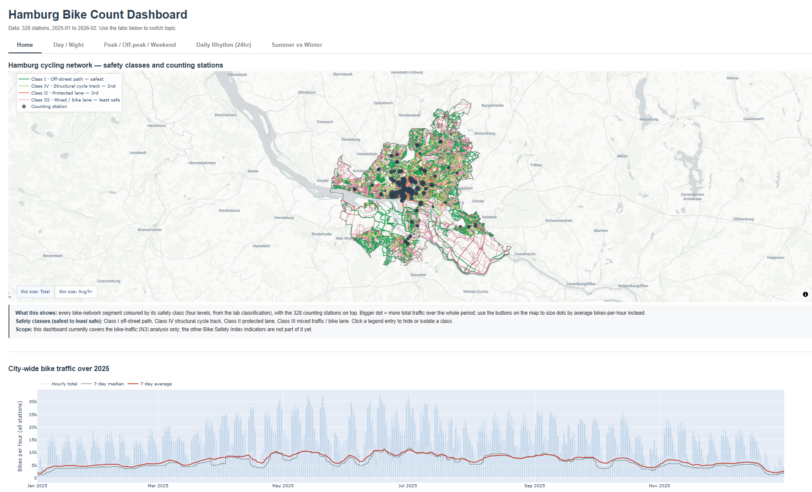

# Hamburg Bike Count Dashboard

An interactive HTML dashboard built from Hamburg's public bike-counter network
(`HH_STA_HamburgerRadzaehlnetz`, 328 stations, hourly, 2025-01 to 2026-02), plus a supporting
notebook pipeline that produces it. This is part of the wider Bike Safety Index work; the other
indicators are not part of this package yet.

> **Just want to look at it?** Open `bike_dashboard.html` in any modern browser (an internet
> connection is needed the first time, so the map tiles and the Plotly library can load).



## What the dashboard shows

Five tabs:

- **Home** — the whole cycling network coloured by safety class, with all 328 counting stations on
  top (dot size = total traffic, or average bikes-per-hour via a toggle on the map), plus a
  city-wide hourly-traffic chart for 2025 and shortcut cards to the other tabs.
- **Day / Night** — how the day-vs-night traffic balance varies by station and month.
- **Peak / Off-peak / Weekend** — commuter peaks vs off-peak vs weekend riding.
- **Daily Rhythm (24hr)** — the 24-hour shape of a typical day.
- **Summer vs Winter** — which stations are the most seasonal (summer/winter ratio map), and how
  the shape of the day changes between the two seasons.

The seasonal maps (Day/Night, Peak, Summer vs Winter) show a faint grey bike-network and the
Hamburg city boundary underneath the station dots for spatial context.

## Data

- Source: Hamburg's public bike-counter network (`HH_STA_HamburgerRadzaehlnetz`) — 328 stations,
  hourly readings, 2025-01 to 2026-02.
- The bike-network safety classification (Class I–IV) comes from the lab's classification of the
  city's cycle infrastructure.
- Only aggregate counts are used — no personal data.

## How it's built / reproducing it

The dashboard is produced by a numbered notebook pipeline (`0_…` to `10_…`). The committed
`output/` folder already contains everything the dashboard needs, so to rebuild just the dashboard
you only run the last notebook:

```bash
pip install -r requirements.txt
jupyter nbconvert --to notebook --execute --inplace 8_Combined_Dashboard.ipynb
```

Full run order, how the notebooks map to the earlier numbering, which files were retired, and the
known limitations are documented in **`PIPELINE_STATUS.md`**.
